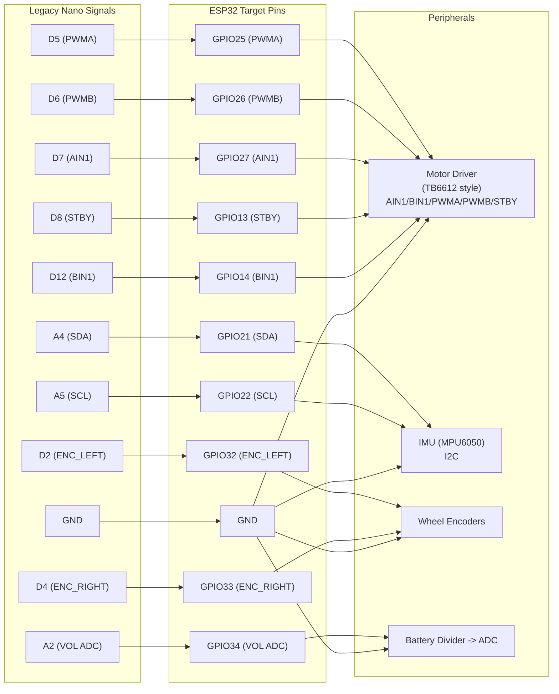

# ESP32 Wiring Map (From Current Nano Build)

This maps the current `balance_mvp_v2_core` signal layout to an ESP32 DevKit-style board.

## Drop-In Pins Block (ESP32)
```cpp
namespace Pins {
  const uint8_t LED = 2;        // Onboard LED (common on many ESP32 dev boards)

  const uint8_t ENC_LEFT = 32;  // Encoder A / left tick
  const uint8_t ENC_RIGHT = 33; // Encoder B / right tick

  const uint8_t PWMA = 25;      // Motor A PWM
  const uint8_t PWMB = 26;      // Motor B PWM
  const uint8_t AIN1 = 27;      // Motor A direction
  const uint8_t STBY = 13;      // Driver standby/enable
  const uint8_t BIN1 = 14;      // Motor B direction

  const uint8_t VOL = 34;       // Battery sense ADC (input-only pin)
}

// I2C pins on ESP32 (replace Wire.begin() with:)
// Wire.begin(21, 22); // SDA=21, SCL=22
```

## Nano -> ESP32 Signal Mapping

| Signal | Nano Pin | ESP32 Pin |
|---|---:|---:|
| `ENC_LEFT` | `D2` | `GPIO32` |
| `ENC_RIGHT` | `D4` | `GPIO33` |
| `PWMA` | `D5` | `GPIO25` |
| `PWMB` | `D6` | `GPIO26` |
| `AIN1` | `D7` | `GPIO27` |
| `STBY` | `D8` | `GPIO13` |
| `BIN1` | `D12` | `GPIO14` |
| `VOL` | `A2` | `GPIO34` |
| `SDA` (IMU) | `A4` | `GPIO21` |
| `SCL` (IMU) | `A5` | `GPIO22` |
| `GND` | `GND` | `GND` |

## Mermaid Wiring Diagram


## Solder Notes
- Keep a single shared ground between ESP32, motor driver, IMU, encoder board, and battery divider.
- `GPIO34` is input-only (good for `VOL` ADC; do not use as output).
- ESP32 is 3.3V logic: confirm motor driver and encoder outputs are 3.3V-safe.
- If IMU board is 5V-powered, verify I2C pullups are not forcing 5V on SDA/SCL.
